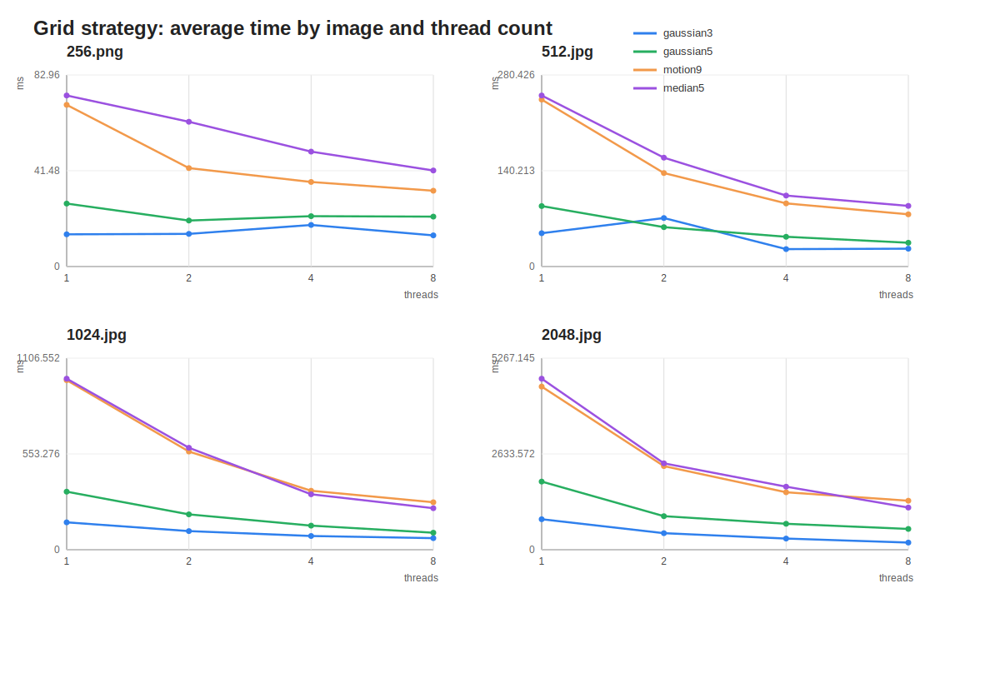
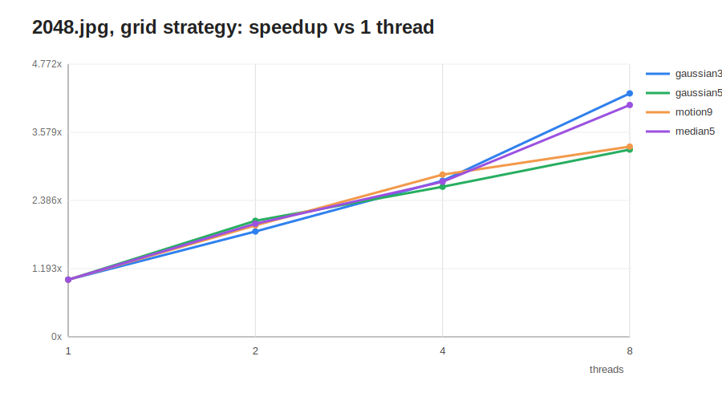
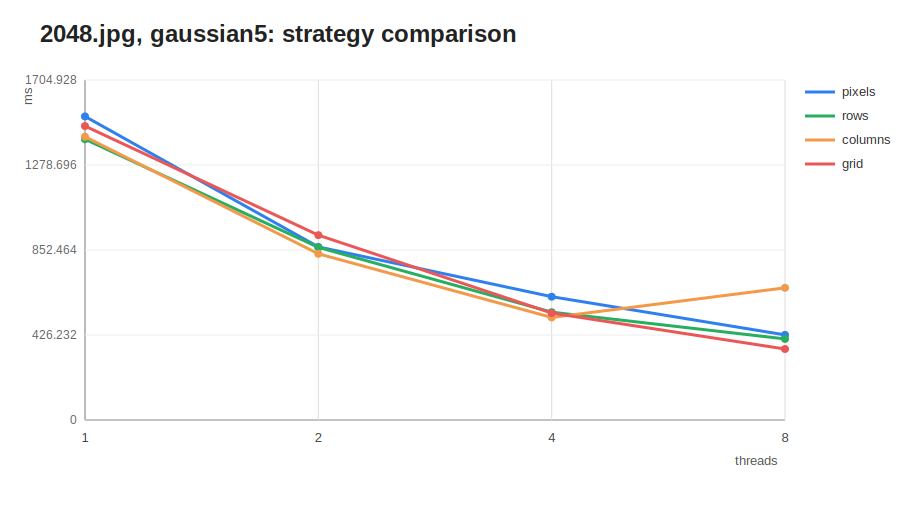

# Задание 2: параллельная фильтрация цветных изображений

## Описание

В этом проекте я реализовал параллельную обработку одного цветного RGB-изображения. Последовательная версия оставлена как baseline, чтобы можно было сравнить корректность и скорость параллельных фильтров.

Изображение хранится как плоский RGB-массив `width * height * 3`: для каждого пикселя подряд лежат каналы `R`, `G` и `B`. Свёртка и median filter применяются отдельно к каждому каналу, поэтому результат остаётся цветным.

Код разложен по пакетам:

- `image` — загрузка, сохранение и хранение RGB-изображения;
- `filter` — последовательные фильтры, ядра свёртки и median filter;
- `parallel` — параллельная обработка и стратегии разбиения изображения;
- `app` — логика командной строки;

## Сборка и запуск

Требования:

- Git;
- Maven;
- Java 24.

Сборка:

```bash
mvn clean package
```

Последовательная обработка:

```bash
java -cp target/classes app.Main apply <input> <output> <filterName>
java -cp target/classes app.Main benchmark <input> <filterName> <iterations>
```

Параллельная обработка:

```bash
java -cp target/classes app.Main apply-parallel <input> <output> <filterName> <strategy> <threads>
java -cp target/classes app.Main benchmark-parallel <input> <filterName> <strategy> <threads> <iterations>
```

Пример:

```bash
java -cp target/classes app.Main apply-parallel input.png output.png gaussian5 grid 8
```

## Поддерживаемые фильтры

- `identity`
- `blur3`
- `blur5`
- `gaussian3`
- `gaussian5`
- `gaussian3_exact`
- `motion9`
- `edge_horizontal5`
- `edge_vertical5`
- `edge_45deg5`
- `edge_all3`
- `sharpen3`
- `sharpen5`
- `edge_excessive3`
- `emboss3`
- `emboss5`
- `mean3`
- `median3`
- `median5`
- `median7`

## Стратегии параллелизации

| Стратегия | Идея |
|-----------|------|
| `pixels` | Потоки берут отдельные пиксели через общий атомарный счётчик. |
| `rows` | Изображение делится на горизонтальные полосы. |
| `columns` | Изображение делится на вертикальные полосы. |
| `grid` | Изображение делится на прямоугольную сетку блоков. |

## Тестирование

Проверяются основные свойства реализации:

- параллельная свёртка совпадает с последовательной для всех стратегий;
- параллельный median filter совпадает с последовательным для всех стратегий;
- параллельная обработка работает, если потоков больше, чем частей изображения;
- последовательные тесты проверяют `identity`, нулевое ядро, размер результата, диапазон каналов и работу median filter.

Запуск тестов:

```bash
mvn test
```

В текущей среде Maven не был доступен в `PATH`, поэтому я дополнительно проверил компиляцию через `javac 24`.

## Исследование производительности

Параметры стенда взяты из первого задания, на той же машине и тех же изображениях:

- ОС: Windows 11 Pro;
- CPU: 11th Gen Intel(R) Core(TM) i7-11370H @ 3.30 GHz;
- RAM: 16 ГБ;
- Java runtime: Java 24;
- компиляция проекта: Java 22 в `pom.xml`, фактическая проверка через `javac 24`;
- изображения: `256.png`, `512.jpg`, `1024.jpg`, `2048.jpg` из локальной папки `D:\temp`;
- фильтры: `gaussian3`, `gaussian5`, `motion9`, `median5`;
- количество потоков: `1`, `2`, `4`, `8`;
- основная стратегия для полного прогона: `grid`;
- число итераций каждого замера: `3`.

Исходные фотографии в репозиторий не добавлены. В `research` сохранены только CSV с результатами и графики.

### Графики







### Результаты grid на 2048.jpg

| Фильтр | 1 поток, мс | 8 потоков, мс | Ускорение | 8 потоков, MPix/s |
|--------|------------:|--------------:|----------:|------------------:|
| `gaussian3` | 838.506 | 196.787 | 4.26x | 21.314 |
| `gaussian5` | 1873.647 | 571.692 | 3.28x | 7.337 |
| `motion9` | 4484.936 | 1347.244 | 3.33x | 3.113 |
| `median5` | 4702.808 | 1159.077 | 4.06x | 3.619 |

### Время grid с 8 потоками, мс

| Изображение | `gaussian3` | `gaussian5` | `motion9` | `median5` |
|-------------|------------:|------------:|----------:|----------:|
| `256.png` | 13.498 | 21.615 | 32.824 | 41.589 |
| `512.jpg` | 26.127 | 34.821 | 76.423 | 88.778 |
| `1024.jpg` | 66.887 | 98.233 | 274.166 | 239.871 |
| `2048.jpg` | 196.787 | 571.692 | 1347.244 | 1159.077 |

### Gaussian5 на 2048.jpg: сравнение стратегий, мс

| Стратегия | 1 поток | 2 потока | 4 потока | 8 потоков |
|-----------|--------:|---------:|---------:|----------:|
| `pixels` | 1522.257 | 867.941 | 618.262 | 426.717 |
| `rows` | 1407.786 | 865.590 | 540.636 | 406.503 |
| `columns` | 1420.443 | 833.310 | 514.156 | 662.849 |
| `grid` | 1473.906 | 926.891 | 536.194 | 355.930 |

## Вывод

На маленьком изображении `256x256` накладные расходы на создание и синхронизацию потоков заметны, поэтому ускорение нестабильное. На `1024x1024` и `2048x2048` параллельная версия уже даёт устойчивый выигрыш: для `2048.jpg` стратегия `grid` ускорила `gaussian3` в `4.26x`, а `median5` в `4.06x`.

Тяжёлые фильтры (`motion9`, `median5`) выполняются дольше, потому что на каждый пиксель приходится больше операций. При сравнении стратегий на `gaussian5` и `2048.jpg` лучший результат показала `grid` с 8 потоками: `355.930 мс`.
